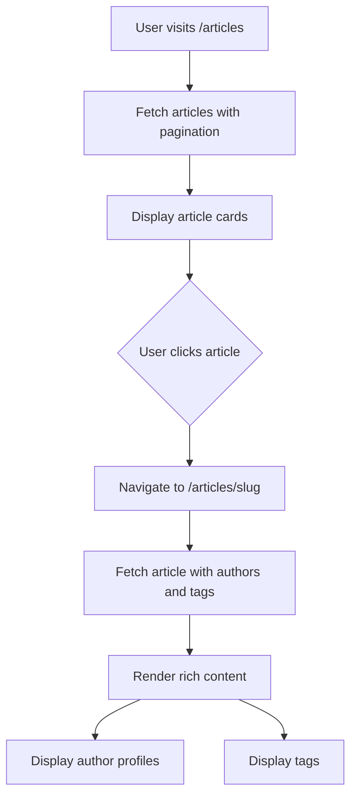

# Design Document: Article System

## Overview

This design implements a blog article feature for a Next.js website using Sanity CMS. The system will support rich content creation with multiple authors, categorization through tags, and comprehensive formatting options including code blocks, images, and external links.

**This leverages existing infrastructure** - the article schema already exists in the codebase, and this design focuses on enhancing and documenting the frontend implementation patterns. The system shares the tags content type with the books feature and references the person content type for author attribution.

The implementation follows the existing patterns in the codebase:

- Sanity schema definitions in the `schema/` directory
- Next.js App Router with route groups in `app/(site)/`
- GROQ queries in `sanity/lib/queries.ts`
- Sanity Live Content API for data fetching
- Presentation Studio support for visual editing

### Code Quality Standards

All generated code must adhere to the project's ESLint configuration:

- **Formatting**: 2-space indentation, semicolons required, double quotes
- **File naming**: kebab-case for all files (e.g., `article-card.tsx`, `article-list.tsx`)
- **TypeScript**: Use `type` instead of `interface` for type definitions
- **Imports**: Sorted using perfectionist/sort-imports rules
- **Environment variables**: Access via `env` module, not `process.env` directly
- **Console statements**: Avoid console.log (warnings enabled)
- **React/TypeScript**: Follow Antfu ESLint config standards

## Architecture

### Content Model

```
Article
├── Metadata (title, slug, dates, authors)
├── Content (rich text with blocks, images, code, links)
├── Media (featured image with caption and attribution)
├── Categorization (tags)
└── Attribution (original source URL)

Person (Referenced)
├── Name
├── Slug
├── Bio
└── Image
```

### Page Structure

```
/articles
├── page.tsx (List all articles)
└── [slug]/
    └── page.tsx (Article detail)
```

### Content Flow



## Components and Interfaces

### 1. Sanity Schema Definitions

#### Article Schema (`schema/articles.js`)

The existing schema already includes:

```javascript
{
  name: "article",
  title: "Articles",
  type: "document",
  fields: [
    { name: "name", type: "string", title: "Article Title" },
    { name: "slug", type: "slug", source: "name", maxLength: 100 },
    { name: "tags", type: "array", of: [reference to "tags"] },
    { name: "author", type: "array", of: [reference to "person"] },
    { name: "bodycopy", type: "array", of: [block, code, image] },
    { name: "origurl", type: "string", title: "Original Source Material" },
    { name: "asset", type: "image", title: "Asset" (featured image) }
  ]
}
```

**Block Content Configuration:**

- Supports normal paragraphs
- Heading levels: H2, H3, H4, H5
- Block quotes
- Code blocks with language selection
- Inline images with caption, alt text, and hotspot
- Hyperlinks with URL validation

### 2. TypeScript Types

```typescript
// types/article.ts
export type Article = {
  _id: string;
  _type: "article";
  _createdAt: string;
  _updatedAt: string;
  name: string; // Article title
  slug: string;
  tags?: Tag[];
  author?: Person[];
  bodycopy: PortableTextBlock[];
  origurl?: string;
  asset?: {
    _type: "image";
    asset: SanityImageAsset;
    caption?: string;
    attribution?: string;
  };
};

export type Person = {
  _id: string;
  _type: "person";
  name: string;
  slug: string;
  description?: string;
  image?: SanityImage;
};

export type Tag = {
  _id: string;
  _type: "tags";
  name: string;
};
```

### 3. GROQ Queries

```typescript
// sanity/lib/queries.ts

// List all articles with basic info
export const allArticlesQuery = groq`
  *[_type == "article"] | order(_createdAt desc) {
    _id,
    name,
    "slug": slug.current,
    asset,
    "tags": tags[]->{ _id, name },
    "author": author[]->{ _id, name, "slug": slug.current, image },
    _createdAt,
    _updatedAt
  }
`;

// Get single article by slug with all details
export const articleBySlugQuery = groq`
  *[_type == "article" && slug.current == $slug][0] {
    _id,
    _type,
    name,
    "slug": slug.current,
    bodycopy,
    asset,
    origurl,
    "tags": tags[]->{ _id, name },
    "author": author[]->{ 
      _id, 
      name, 
      "slug": slug.current, 
      description,
      image 
    },
    _createdAt,
    _updatedAt
  }
`;

// Paginated articles query with sorting
export const paginatedArticlesQuery = groq`
  *[_type == "article"] | order($orderBy) [$skip...$limit] {
    _id,
    name,
    "slug": slug.current,
    asset,
    "tags": tags[]->{ _id, name },
    "author": author[]->{ _id, name, "slug": slug.current, image },
    _createdAt,
    _updatedAt
  }
`;

// Get articles count for pagination
export const articlesCountQuery = groq`
  count(*[_type == "article"])
`;

// Get articles filtered by tag
export const articlesByTagQuery = groq`
  *[_type == "article" && $tagId in tags[]._ref] | order(_createdAt desc) {
    _id,
    name,
    "slug": slug.current,
    asset,
    "tags": tags[]->{ _id, name },
    "author": author[]->{ _id, name, "slug": slug.current, image },
    _createdAt,
    _updatedAt
  }
`;

// Get all article slugs for static generation
export const allArticleSlugsQuery = groq`
  *[_type == "article" && defined(slug.current)][].slug.current
`;
```

### 4. Frontend Components

#### Article List Page (`app/(site)/articles/page.tsx`)

- Fetches paginated articles using `paginatedArticlesQuery`
- Accepts query parameters: `sort` (date-asc, date-desc, updated), `tag` (filter by tag ID), `page` (pagination)
- Displays grid/list of article cards with featured image, title, authors, tags, dates
- Includes sorting dropdown/buttons
- Includes tag filter chips
- Includes pagination component
- Links to individual article detail pages
- Implements `generateMetadata()` for SEO

#### Article Detail Page (`app/(site)/articles/[slug]/page.tsx`)

- Fetches article data using `articleBySlugQuery`
- Implements `generateStaticParams()` using `allArticleSlugsQuery` for static generation at build time
- Displays article title, featured image, authors, tags, dates
- Renders rich content using `CustomPortableText` component
- Shows original source attribution if provided
- Links to author profile pages
- Links to tag-filtered article lists
- Implements Sanity data attributes for Presentation Studio editing
- Exports metadata for SEO

#### Article Card Component (`app/(site)/components/article-card.tsx`)

- Reusable component for displaying article preview
- Shows featured image, title, excerpt, authors, tags, dates
- Used in article list page
- Responsive design for mobile/tablet/desktop

#### Author Display Component (`app/(site)/components/author-display.tsx`)

- Displays author information with avatar and name
- Supports multiple authors
- Links to author profile pages
- Used in article cards and detail pages

#### Tag Chip Component (`app/(site)/components/tag-chip.tsx`)

- Displays a single tag as a clickable chip
- Links to tag-filtered article list
- Reusable across article cards and detail pages

## Data Models

### Article Document

| Field     | Type   | Required | Description                                  |
| --------- | ------ | -------- | -------------------------------------------- |
| name      | string | Yes      | Article title                                |
| slug      | slug   | Yes      | URL-friendly identifier (auto from title)    |
| tags      | array  | No       | References to tag documents                  |
| author    | array  | No       | References to person documents               |
| bodycopy  | array  | Yes      | Rich text content with blocks, images, code  |
| origurl   | string | No       | Original source URL for attribution          |
| asset     | image  | No       | Featured image with caption and attribution  |

### Person Document (Referenced)

| Field       | Type   | Required | Description                |
| ----------- | ------ | -------- | -------------------------- |
| name        | string | Yes      | Person's name              |
| slug        | slug   | Yes      | URL-friendly identifier    |
| description | text   | No       | Short bio                  |
| image       | image  | No       | Profile photo with hotspot |

### Tag Document (Referenced)

| Field | Type   | Required | Description |
| ----- | ------ | -------- | ----------- |
| name  | string | Yes      | Tag name    |

## Correctness Properties

*A property is a characteristic or behavior that should hold true across all valid executions of a system-essentially, a formal statement about what the system should do. Properties serve as the bridge between human-readable specifications and machine-verifiable correctness guarantees.*


### Property Reflection

After reviewing the prework analysis, several properties can be consolidated:

- **URL validation properties (2.10, 5.4)**: Both test URL validation and can be combined into a single comprehensive property
- **Date formatting properties (4.6, 10.5)**: Both test the same date formatting behavior
- **Rendering properties (3.2, 3.3, 3.5)**: These test that list/detail views contain required fields and can be combined into comprehensive rendering properties
- **Image optimization properties (9.2, 9.3, 9.5)**: These all test Sanity image URL generation and can be combined

The following properties provide unique validation value and will be retained:

- Slug generation (1.2)
- Image alt text validation (2.9)
- URL validation (2.10, 5.4 combined)
- Article list rendering (3.2, 3.3 combined)
- Article detail rendering (3.5, 3.6, 3.7, 3.8, 3.9 combined)
- Required field validation (4.3)
- Date formatting (4.6, 10.5 combined)
- Data persistence round-trip (5.2)
- Attribution display (5.3)
- Multiple authors display (6.2, 6.4 combined)
- Tag filtering (7.2)
- Filter state in URL (7.4)
- Image alt text fallback (9.4)
- Image CDN URL generation (9.2, 9.3, 9.5 combined)
- Date display (10.3, 10.4 combined)
- Code block rendering (11.3, 11.4 combined)
- Sorting logic (12.2, 12.3, 12.4 combined)
- Sort state in URL (12.6)

### Correctness Properties

Property 1: Slug generation produces URL-safe strings
*For any* article title, generating a slug should produce a string containing only lowercase letters, numbers, and hyphens
**Validates: Requirements 1.2**

Property 2: Images without alt text are rejected
*For any* inline image submission without alt text, the validation should reject the submission
**Validates: Requirements 2.9**

Property 3: URL validation accepts valid URLs and rejects invalid ones
*For any* URL string, the validation should accept properly formatted URLs (with protocol and domain) and reject malformed URLs
**Validates: Requirements 2.10, 5.4**

Property 4: Article list rendering includes all required fields
*For any* article in a list view, the rendered output should contain the article title, featured image reference, author information, tags, creation date, and last updated date
**Validates: Requirements 3.2, 3.3**

Property 5: Article detail rendering includes all content
*For any* article detail page, the rendered output should contain the title, authors with profile links, tags with filter links, featured image (if present), and formatted rich text content
**Validates: Requirements 3.5, 3.6, 3.7, 3.8, 3.9**

Property 6: Required field validation rejects incomplete articles
*For any* article submission missing required fields (title, slug, bodycopy), the validation should reject the submission
**Validates: Requirements 4.3**

Property 7: Date formatting produces British English format
*For any* date value, the formatter should produce a string in the format "DD MMM YYYY" (e.g., "26 Nov 2025")
**Validates: Requirements 4.6, 10.5**

Property 8: Article data persistence round-trip
*For any* article with an original source URL, saving the article and then retrieving it should return the same original URL value
**Validates: Requirements 5.2**

Property 9: Attribution display for sourced content
*For any* article with an original source URL, the detail page rendering should include attribution information with the source URL
**Validates: Requirements 5.3**

Property 10: Multiple authors display completely
*For any* article with multiple authors, the detail page rendering should include all authors with links to their respective profile pages
**Validates: Requirements 6.2, 6.4**

Property 11: Tag filtering returns only matching articles
*For any* tag filter applied to the article list, all returned articles should have that tag in their tags array
**Validates: Requirements 7.2**

Property 12: Filter state persists in URL
*For any* tag filter selection, the URL should contain a query parameter with the tag ID
**Validates: Requirements 7.4**

Property 13: Image alt text fallback to caption
*For any* image without alt text but with a caption, the rendered img element should use the caption as the alt attribute value
**Validates: Requirements 9.4**

Property 14: Sanity image CDN URL generation
*For any* image asset, the generated image URL should include Sanity CDN domain, format parameters (WebP), and size parameters for responsive images
**Validates: Requirements 9.2, 9.3, 9.5**

Property 15: Article dates display on detail page
*For any* article detail page, the rendered output should include the creation date, and if the article has been updated (updatedAt > createdAt), it should also display the last updated date
**Validates: Requirements 10.3, 10.4**

Property 16: Code block rendering preserves formatting
*For any* code block with specified language and content, the rendered output should include syntax highlighting markup and preserve all indentation and line breaks from the original
**Validates: Requirements 11.3, 11.4**

Property 17: Article sorting maintains order
*For any* list of articles sorted by a date field (creation or updated) in a direction (ascending or descending), each article's date value should maintain the correct ordering relationship with the next article
**Validates: Requirements 12.2, 12.3, 12.4**

Property 18: Sort state persists in URL
*For any* sort option selection, the URL should contain a query parameter with the sort field and direction
**Validates: Requirements 12.6**

## Error Handling

### Content Not Found

- Use Next.js `notFound()` function when article doesn't exist
- Display custom 404 page with navigation back to articles list
- Log missing content requests for monitoring

### Invalid Slugs

- Validate slug format in page components
- Return 404 for malformed slugs
- Sanitize slug input to prevent injection

### Image Loading Failures

- Provide fallback placeholder for missing featured images
- Use Sanity's image CDN with automatic optimization
- Implement lazy loading for performance
- Handle missing inline images gracefully in portable text rendering

### Author/Tag Reference Failures

- Handle missing author references gracefully (display "Unknown Author")
- Handle missing tag references gracefully (skip broken references)
- Log reference integrity issues for monitoring

### Portable Text Rendering Errors

- Implement error boundaries for rich content rendering
- Provide fallback UI for malformed content blocks
- Log rendering errors for debugging
- Ensure code blocks with unsupported languages still render (without highlighting)

### URL Validation Errors

- Display clear error messages for invalid URLs
- Prevent submission with malformed URLs
- Provide examples of valid URL formats

## Testing Strategy

### Unit Tests

- Test slug generation from various title formats (spaces, special characters, unicode)
- Test date formatting with different date values
- Test URL validation with valid and invalid URLs
- Test image alt text fallback logic
- Test author display with single and multiple authors
- Test tag filtering logic
- Test sorting logic with various date combinations

### Property-Based Tests

The property-based testing approach will use **fast-check** (JavaScript/TypeScript PBT library) with a minimum of 100 iterations per property.

Each property-based test must:
- Be tagged with a comment referencing the design document property: `**Feature: articles, Property {number}: {property_text}**`
- Run at least 100 iterations to ensure comprehensive coverage
- Use smart generators that constrain to valid input spaces

**Property Test Coverage:**

1. **Property 1 - Slug Generation**: Generate random article titles (including special characters, spaces, unicode) and verify slugs are URL-safe
2. **Property 2 - Image Alt Text Validation**: Generate random image objects with/without alt text and verify validation behavior
3. **Property 3 - URL Validation**: Generate random URL strings (valid and invalid formats) and verify validation accepts/rejects correctly
4. **Property 4 - List Rendering**: Generate random articles and verify list rendering includes all required fields
5. **Property 5 - Detail Rendering**: Generate random articles with various content types and verify detail rendering is complete
6. **Property 6 - Required Fields**: Generate random article objects with missing required fields and verify validation rejects them
7. **Property 7 - Date Formatting**: Generate random dates and verify British English format output
8. **Property 8 - Data Persistence**: Generate random articles with original URLs, simulate save/retrieve, verify round-trip
9. **Property 9 - Attribution Display**: Generate random articles with original URLs and verify attribution appears in rendering
10. **Property 10 - Multiple Authors**: Generate random articles with multiple authors and verify all appear with links
11. **Property 11 - Tag Filtering**: Generate random articles and tag filters, verify filtered results only contain matching articles
12. **Property 12 - Filter URL State**: Generate random tag selections and verify URL contains correct parameters
13. **Property 13 - Alt Text Fallback**: Generate random images without alt text but with captions, verify fallback behavior
14. **Property 14 - Image CDN URLs**: Generate random image assets and verify generated URLs include CDN, format, and size parameters
15. **Property 15 - Date Display**: Generate random articles with various creation/update dates and verify correct date display
16. **Property 16 - Code Block Rendering**: Generate random code blocks with various languages and content, verify formatting preservation
17. **Property 17 - Sorting**: Generate random article lists and sort options, verify ordering is maintained
18. **Property 18 - Sort URL State**: Generate random sort selections and verify URL contains correct parameters

### Integration Tests

- Test article list page renders with mock data
- Test article detail page displays all fields correctly
- Test pagination functionality
- Test tag filtering updates the article list
- Test sorting updates the article list
- Test CustomPortableText rendering with various content types
- Test author profile links navigate correctly
- Test tag filter links navigate correctly

### End-to-End Tests

- Test complete user flow: browse articles → filter by tag → view article → click author
- Test Presentation Studio editing workflow
- Test responsive design on mobile/tablet/desktop
- Test image loading and optimization
- Test code block syntax highlighting
- Test external link navigation

### Sanity Studio Tests

- Verify schema validation rules work correctly
- Test required field enforcement
- Test slug generation and uniqueness
- Test reference integrity between articles, authors, and tags
- Test image upload and hotspot functionality
- Test URL validation in CMS

## Implementation Notes

### Presentation Studio Support

- All fields must include proper data attributes using `createDataAttribute`
- Article pages need `_id` and `_type` for Studio integration
- Use `stega` encoding for live preview updates
- Configure Studio URL in `sanity/lib/api.ts`

### Performance Considerations

- Use Sanity's image CDN with automatic format optimization (WebP)
- Implement pagination for article list (reuse existing pagination component)
- Use Next.js static generation with `generateStaticParams()` for all article pages at build time
- Implement Incremental Static Regeneration (ISR) with appropriate revalidation period
- Cache GROQ query results with appropriate revalidation
- Pre-generate all static paths during build for optimal performance
- Lazy load images below the fold
- Implement code splitting for syntax highlighting library

### SEO Optimization

- Generate metadata for each article page using Next.js metadata API
- Use article title as page title
- Generate meta description from first 160 characters of content
- Use featured image as OG image (fallback to site default)
- Include author information in metadata
- Implement structured data (Schema.org Article markup) with author, publication date, and tags
- Generate sitemap including all article pages
- Ensure all meta tags are properly formatted for search engines and social media
- Include canonical URLs to prevent duplicate content issues

### Accessibility

- Ensure proper heading hierarchy (h1 → h2 → h3)
- Provide alt text for all images (with caption fallback)
- Use semantic HTML for article structure
- Ensure keyboard navigation works for all interactive elements
- Test with screen readers
- Ensure sufficient color contrast for text
- Provide skip links for navigation
- Ensure code blocks are accessible (proper ARIA labels)

### Code Block Syntax Highlighting

- Use a lightweight syntax highlighting library (e.g., Prism.js or Highlight.js)
- Support common languages: JavaScript, TypeScript, Python, Java, HTML, CSS, Bash
- Implement lazy loading for syntax highlighting to improve initial page load
- Provide fallback rendering for unsupported languages
- Ensure syntax highlighting doesn't break accessibility

### Rich Text Rendering

- Use existing `CustomPortableText` component for consistency
- Ensure all block types are handled (paragraphs, headings, quotes, code, images, links)
- Implement proper spacing between blocks
- Handle nested structures correctly
- Ensure images within content are responsive
- Validate portable text structure before rendering

## Migration and Rollout

### PR Strategy for Incremental Delivery

This implementation is designed to be delivered as a series of incremental PRs into a feature branch, allowing for independent review and testing of each layer.

#### PR1: Foundation Layer (Tasks 1 + 2)

**Files Modified:**

- `types/index.ts` (add Article, Person types)

**Files Verified:**

- `schema/articles.js` (already exists)
- `schema/person.js` (already exists)
- `schema/tags.js` (already exists)

**Dependencies:** None  
**Testing:** Verify types match existing schemas

---

#### PR2: Data Layer (Task 3)

**Files Modified:**

- `sanity/lib/queries.ts` (append article queries)

**Dependencies:** PR1 (types must exist)  
**Testing:** Test GROQ queries return expected data structure

---

#### PR3: Component Layer (Task 4)

**Files Created:**

- `app/(site)/components/article-card.tsx`
- `app/(site)/components/author-display.tsx`
- `app/(site)/components/tag-chip.tsx`

**Dependencies:** PR1 (types)  
**Testing:** Test components render with mock data, verify responsive design

---

#### PR4: Article Listing Page (Task 5)

**Files Created:**

- `app/(site)/articles/page.tsx`

**Dependencies:** PR2 (queries), PR3 (components)  
**Testing:** Test pagination, sorting, filtering, static generation

---

#### PR5: Article Detail Page (Task 6)

**Files Created:**

- `app/(site)/articles/[slug]/page.tsx`

**Dependencies:** PR2 (queries), PR3 (components)  
**Testing:** Test all sections render, authors display, tags display, rich content rendering

---

#### PR6: Navigation & SEO (Tasks 7 + 8)

**Files Modified:**

- Navigation component (add Articles menu item)

**Files Created/Modified:**

- Metadata generation utilities (if needed)

**Dependencies:** PR4, PR5 (pages must exist to link to)  
**Testing:** Test navigation on desktop/mobile, verify SEO metadata

---

#### PR7: Validation & Polish (Tasks 9 + 10)

**Files Modified:**

- Presentation Studio configuration (if needed)
- Schema validation rules (if needed)

**Dependencies:** All previous PRs  
**Testing:** Full integration testing, Presentation Studio editing, accessibility checks, ESLint validation

---

#### Optional PRs (Tasks 11-13)

**Files Created:**

- Test files for unit and property-based tests
- Documentation updates

**Dependencies:** PR7  
**Testing:** Run test suites, verify documentation accuracy

---

### Deployment Strategy

1. Create feature branch from main
2. Merge PRs 1-7 sequentially into feature branch
3. Perform full QA on feature branch
4. Merge feature branch to main
5. Deploy to production
6. Optional: Merge PRs 11-13 for tests and documentation

**Note**: Each PR should be independently reviewable and testable. Later PRs may depend on earlier ones being merged first.

### Existing Infrastructure Leverage

The article system leverages several existing components and patterns:

- **CustomPortableText component**: Already exists for rendering rich content
- **Pagination component**: Already exists and can be reused
- **Tags system**: Already exists and is shared with books
- **Person schema**: Already exists for author attribution
- **Navigation system**: Already exists and just needs an additional menu item
- **Image optimization**: Sanity CDN already configured
- **Static generation patterns**: Already established in books feature

This means the implementation primarily focuses on:
1. Adding article-specific queries
2. Creating article-specific components (card, author display, tag chip)
3. Creating article list and detail pages
4. Integrating with existing navigation

The heavy lifting of CMS integration, rich text rendering, and image optimization is already done.
