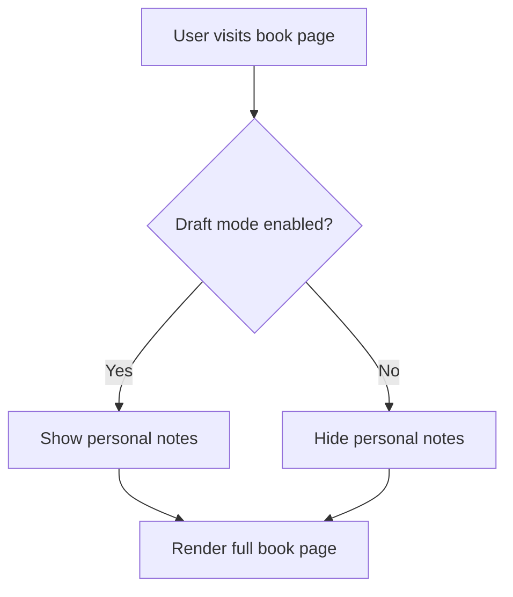

# Design Document: Leadership Book Summary System

## Overview

This design implements a leadership book summary feature for a Next.js website using Sanity CMS. The system will consist of two main content types (Book and Chapter) with a parent-child relationship, frontend pages for browsing and viewing books, and conditional rendering of private notes based on authentication status.

**This is an additive implementation** - all changes are new files and features that do not modify existing article functionality. The only shared resource is the existing tags system, which books will reference without modification.

The implementation follows the existing patterns in the codebase:

- Sanity schema definitions in the `schema/` directory
- Next.js App Router with route groups in `app/(site)/`
- GROQ queries in `sanity/lib/queries.ts`
- Sanity Live Content API for data fetching
- Presentation Studio support for visual editing

### Code Quality Standards

All generated code must adhere to the project's ESLint configuration:

- **Formatting**: 2-space indentation, semicolons required, double quotes
- **File naming**: kebab-case for all files (e.g., `book-card.tsx`, `rating-stars.tsx`)
- **TypeScript**: Use `type` instead of `interface` for type definitions
- **Imports**: Sorted using perfectionist/sort-imports rules
- **Environment variables**: Access via `env` module, not `process.env` directly
- **Console statements**: Avoid console.log (warnings enabled)
- **React/TypeScript**: Follow Antfu ESLint config standards

## Architecture

### Content Model

```
Book (Parent)
├── Metadata (title, author, slug, dates, links, cover)
├── Content (summary, rating, key takeaways, personal notes)
├── Flags (AI summary indicator)
├── Relationships (chapters, related books, quotes)
└── SEO (meta fields)

Chapter (Child)
├── Metadata (chapter number, title, slug)
├── Content (chapter summary)
├── Parent Book Reference
└── Quotes (child references)

Quote/Highlight (Child)
├── Content (quote text, context)
├── Parent Book Reference (required)
└── Parent Chapter Reference (optional)
```

### Page Structure

```
/books
├── page.tsx (List all books)
└── [slug]/
    ├── page.tsx (Book detail)
    └── chapters/
        └── [chapterSlug]/
            └── page.tsx (Chapter detail)
```

### Authentication Flow



## Components and Interfaces

### 1. Sanity Schema Definitions

#### Book Schema (`schema/book.js`)

```javascript
{
  name: "book",
  title: "Leadership Books",
  type: "document",
  fields: [
    // Metadata
    { name: "title", type: "string", required: true },
    { name: "slug", type: "slug", source: "title" },
    { name: "author", type: "string", required: true },
    { name: "bookWebsite", type: "url", optional: true },
    { name: "amazonLink", type: "url" },
    { name: "amazonAffiliateLink", type: "url" },
    { name: "coverImage", type: "image", hotspot: true },
    { name: "dateRead", type: "date", optional: true },

    // Content
    { name: "rating", type: "number", min: 1, max: 5 },
    { name: "summary", type: "array", of: [block, code, image] },
    { name: "keyTakeaways", type: "array", of: [block] },
    { name: "personalNotes", type: "text" },
    { name: "isAiSummary", type: "boolean", default: false },

    // Categorization
    { name: "tags", type: "array", of: [reference to "tags"] },

    // SEO
    { name: "metaDescription", type: "text", optional: true, maxLength: 160 },
    { name: "metaTitle", type: "string", optional: true, maxLength: 60 },
    { name: "ogImage", type: "image", optional: true },
    { name: "focusKeyword", type: "string", optional: true },

    // Relationships
    { name: "relatedBooks", type: "array", of: [reference to "book"] },
    { name: "chapters", type: "array", of: [reference to "chapter"] }
  ]
}
```

#### Quote Schema (`schema/quote.js`)

```javascript
{
  name: "quote",
  title: "Book Quotes & Highlights",
  type: "document",
  fields: [
    { name: "quoteText", type: "text", required: true },
    { name: "context", type: "text", optional: true },
    { name: "parentBook", type: "reference", to: [{ type: "book" }], required: true },
    { name: "parentChapter", type: "reference", to: [{ type: "chapter" }], optional: true }
  ]
}
```

#### Chapter Schema (`schema/chapter.js`)

```javascript
{
  name: "chapter",
  title: "Book Chapters",
  type: "document",
  fields: [
    { name: "chapterNumber", type: "string", required: true },
    { name: "title", type: "string", required: true },
    { name: "slug", type: "slug", source: "title" },
    { name: "summary", type: "array", of: [block, code, image] },
    { name: "parentBook", type: "reference", to: [{ type: "book" }], required: true }
  ]
}
```

### 2. TypeScript Types

```typescript
// types/book.ts
export type Book = {
  _id: string;
  _type: "book";
  _createdAt: string;
  _updatedAt: string;
  title: string;
  slug: string;
  author: string;
  bookWebsite?: string;
  amazonLink: string;
  amazonAffiliateLink: string;
  coverImage: SanityImage;
  dateRead?: string;
  rating: number;
  summary: PortableTextBlock[];
  keyTakeaways: PortableTextBlock[];
  personalNotes?: string;
  isAiSummary: boolean;
  tags?: Tag[];
  metaDescription?: string;
  metaTitle?: string;
  ogImage?: SanityImage;
  focusKeyword?: string;
  relatedBooks?: Book[];
  chapters?: Chapter[];
  quotes?: Quote[];
};

export type Chapter = {
  _id: string;
  _type: "chapter";
  chapterNumber: string;
  title: string;
  slug: string;
  summary: PortableTextBlock[];
  parentBook: {
    _ref: string;
    title: string;
    slug: string;
  };
};

export type Quote = {
  _id: string;
  _type: "quote";
  quoteText: string;
  context?: string;
  parentBook: {
    _ref: string;
    title: string;
  };
  parentChapter?: {
    _ref: string;
    title: string;
  };
};
```

### 3. GROQ Queries

```typescript
// sanity/lib/queries.ts

// List all books with basic info
export const allBooksQuery = groq`
  *[_type == "book"] | order(dateRead desc, _createdAt desc) {
    _id,
    title,
    "slug": slug.current,
    author,
    rating,
    coverImage,
    dateRead,
    "tags": tags[]->{ _id, name },
    _createdAt,
    _updatedAt
  }
`;

// Get single book by slug with all details
export const bookBySlugQuery = groq`
  *[_type == "book" && slug.current == $slug][0] {
    _id,
    _type,
    title,
    "slug": slug.current,
    author,
    bookWebsite,
    amazonLink,
    amazonAffiliateLink,
    coverImage,
    dateRead,
    rating,
    summary,
    keyTakeaways,
    personalNotes,
    isAiSummary,
    "tags": tags[]->{ _id, name },
    metaDescription,
    metaTitle,
    ogImage,
    focusKeyword,
    "relatedBooks": relatedBooks[]->{
      _id,
      title,
      "slug": slug.current,
      author,
      rating,
      coverImage
    },
    _createdAt,
    _updatedAt,
    "chapters": *[_type == "chapter" && references(^._id)] | order(chapterNumber) {
      _id,
      chapterNumber,
      title,
      "slug": slug.current
    },
    "quotes": *[_type == "quote" && references(^._id) && !defined(parentChapter)] {
      _id,
      quoteText,
      context
    }
  }
`;

// Get chapter by slug with parent book info
export const chapterBySlugQuery = groq`
  *[_type == "chapter" && slug.current == $slug][0] {
    _id,
    _type,
    chapterNumber,
    title,
    "slug": slug.current,
    summary,
    "parentBook": parentBook->{
      _id,
      title,
      "slug": slug.current,
      author
    },
    "quotes": *[_type == "quote" && references(^._id)] {
      _id,
      quoteText,
      context
    }
  }
`;

// Paginated books query with sorting
export const paginatedBooksQuery = groq`
  *[_type == "book"] | order($orderBy) [$skip...$pageSize] {
    _id,
    title,
    "slug": slug.current,
    author,
    rating,
    coverImage,
    dateRead,
    "tags": tags[]->{ _id, name },
    "bookCount": count(*[_type == "book"])
  }
`;

// Get all book slugs for static generation
export const allBookSlugsQuery = groq`
  *[_type == "book" && defined(slug.current)][].slug.current
`;

// Get all chapter slugs for static generation
export const allChapterSlugsQuery = groq`
  *[_type == "chapter" && defined(slug.current)] {
    "slug": slug.current,
    "bookSlug": parentBook->slug.current
  }
`;
```

### 4. Frontend Components

#### Book List Page (`app/(site)/books/page.tsx`)

- Fetches paginated books using `paginatedBooksQuery`
- Accepts sort query parameter (rating, dateRead, author)
- Displays grid/list of book cards with cover, title, author, rating, tags
- Includes sorting dropdown/buttons
- Includes pagination component
- Links to individual book detail pages

#### Book Detail Page (`app/(site)/books/[slug]/page.tsx`)

- Fetches book data using `bookBySlugQuery`
- Implements `generateStaticParams()` using `allBookSlugsQuery` for static generation at build time
- Displays full book information including cover, metadata, rating, summary, tags
- Shows key takeaways section
- Displays quotes/highlights section
- Shows related books section with book cards
- Conditionally renders personal notes based on draft mode
- Lists chapters with links to chapter pages
- Uses `CustomPortableText` for rich content rendering
- Implements Sanity data attributes for Presentation Studio editing
- Exports metadata for SEO

#### Chapter Detail Page (`app/(site)/books/[slug]/chapters/[chapterSlug]/page.tsx`)

- Fetches chapter data using `chapterBySlugQuery`
- Implements `generateStaticParams()` using `allChapterSlugsQuery` for static generation at build time
- Displays chapter number, title, and summary
- Shows chapter-specific quotes/highlights
- Shows breadcrumb navigation back to parent book
- Uses `CustomPortableText` for content rendering
- Implements Sanity data attributes for Presentation Studio editing
- Exports metadata for SEO

#### Book Card Component (`app/(site)/components/book-card.tsx`)

- Reusable component for displaying book preview
- Shows cover image, title, author, rating stars
- Used in book list page

#### Rating Display Component (`app/(site)/components/rating-stars.tsx`)

- Displays visual star rating (1-5)
- Reusable across book list and detail pages

#### Quote Card Component (`app/(site)/components/quote-card.tsx`)

- Displays a quote with optional context
- Used on book and chapter detail pages
- Styled with quotation marks and proper typography

## Data Models

### Book Document

| Field               | Type    | Required | Description                                        |
| ------------------- | ------- | -------- | -------------------------------------------------- |
| title               | string  | Yes      | Book title                                         |
| slug                | slug    | Yes      | URL-friendly identifier                            |
| author              | string  | Yes      | Author name                                        |
| bookWebsite         | url     | No       | Official book website                              |
| amazonLink          | url     | Yes      | Standard Amazon link                               |
| amazonAffiliateLink | url     | Yes      | Amazon affiliate link                              |
| coverImage          | image   | Yes      | Book cover image with hotspot                      |
| dateRead            | date    | No       | When the book was finished                         |
| rating              | number  | Yes      | Personal rating (1-5)                              |
| summary             | array   | Yes      | Rich text main summary                             |
| keyTakeaways        | array   | Yes      | List of key insights                               |
| personalNotes       | text    | No       | Private notes (auth-only)                          |
| isAiSummary         | boolean | Yes      | AI generation flag                                 |
| tags                | array   | No       | References to tag documents (shared with articles) |
| metaDescription     | text    | No       | Custom meta description (max 160 chars)            |
| metaTitle           | string  | No       | Custom page title (max 60 chars)                   |
| ogImage             | image   | No       | Custom Open Graph image for social sharing         |
| focusKeyword        | string  | No       | Primary SEO keyword                                |
| relatedBooks        | array   | No       | References to related book documents               |
| chapters            | array   | No       | References to chapter documents                    |

### Quote Document

| Field         | Type      | Required | Description                            |
| ------------- | --------- | -------- | -------------------------------------- |
| quoteText     | text      | Yes      | The quote or highlight text            |
| context       | text      | No       | Additional context or commentary       |
| parentBook    | reference | Yes      | Reference to parent book               |
| parentChapter | reference | No       | Optional reference to specific chapter |

### Chapter Document

| Field         | Type      | Required | Description                                    |
| ------------- | --------- | -------- | ---------------------------------------------- |
| chapterNumber | string    | Yes      | Chapter identifier (e.g., "1", "Introduction") |
| title         | string    | Yes      | Chapter title                                  |
| slug          | slug      | Yes      | URL-friendly identifier                        |
| summary       | array     | Yes      | Rich text chapter summary                      |
| parentBook    | reference | Yes      | Reference to parent book                       |

## Error Handling

### Content Not Found

- Use Next.js `notFound()` function when book/chapter doesn't exist
- Display custom 404 page with navigation back to books list
- Log missing content requests for monitoring

### Invalid Slugs

- Validate slug format in page components
- Return 404 for malformed slugs
- Sanitize slug input to prevent injection

### Image Loading Failures

- Provide fallback placeholder for missing book covers
- Use Sanity's image CDN with automatic optimization
- Implement lazy loading for performance

### Draft Mode Errors

- Gracefully handle draft mode check failures
- Default to hiding personal notes if check fails
- Log authentication errors for debugging

## Testing Strategy

### Unit Tests

- Test GROQ query construction and parameter handling
- Test TypeScript type definitions match Sanity schema
- Test rating validation (1-5 range)
- Test slug generation from titles

### Integration Tests

- Test book list page renders with mock data
- Test book detail page displays all fields correctly
- Test chapter page shows parent book reference
- Test personal notes visibility based on draft mode
- Test pagination functionality
- Test CustomPortableText rendering with various content types

### End-to-End Tests

- Test complete user flow: browse books → view book → read chapter
- Test Presentation Studio editing workflow
- Test draft mode authentication flow
- Test responsive design on mobile/tablet/desktop
- Test image loading and optimization

### Sanity Studio Tests

- Verify schema validation rules work correctly
- Test required field enforcement
- Test slug generation and uniqueness
- Test reference integrity between books and chapters
- Test image upload and hotspot functionality

## Implementation Notes

### Presentation Studio Support

- All fields must include proper data attributes using `createDataAttribute`
- Book and chapter pages need `_id` and `_type` for Studio integration
- Use `stega` encoding for live preview updates
- Configure Studio URL in `sanity/lib/api.ts`

### Authentication for Personal Notes

- Use Next.js `draftMode()` to check authentication status
- Draft mode is enabled when user is logged into Sanity Studio
- Personal notes field only rendered when `draftMode().isEnabled === true`
- No additional authentication layer needed

### Performance Considerations

- Use Sanity's image CDN with automatic format optimization (WebP)
- Implement pagination for book list (reuse existing pagination component)
- Use Next.js static generation with `generateStaticParams()` for all book and chapter pages at build time
- Implement Incremental Static Regeneration (ISR) with appropriate revalidation period
- Cache GROQ query results with appropriate revalidation
- Pre-generate all static paths during build for optimal performance

### SEO Optimization

- Generate metadata for each book page using Next.js metadata API
- Use custom metaTitle if provided, otherwise fall back to book title
- Use custom metaDescription if provided, otherwise generate from summary excerpt (first 160 chars)
- Use custom ogImage if provided, otherwise fall back to book cover
- Include focusKeyword in metadata when provided
- Implement structured data (Schema.org Book markup) with author, rating, and publication info
- Generate sitemap including all book and chapter pages
- Ensure all meta tags are properly formatted for search engines and social media

### Accessibility

- Ensure proper heading hierarchy (h1 → h2 → h3)
- Provide alt text for book cover images
- Use semantic HTML for rating display
- Ensure keyboard navigation works for all interactive elements
- Test with screen readers

## Migration and Rollout

### PR Strategy for Incremental Delivery

This implementation is designed to be delivered as a series of incremental PRs into a feature branch, allowing for independent review and testing of each layer.

#### PR1: Foundation Layer (Tasks 1 + 2)

**Files Created:**

- `schema/book.js`
- `schema/chapter.js`
- `schema/quote.js`
- `types/book.ts`

**Files Modified:**

- `schema/schema.js` (add imports only)

**Dependencies:** None  
**Testing:** Verify schemas in Sanity Studio, test content creation

---

#### PR2: Data Layer (Task 3)

**Files Modified:**

- `sanity/lib/queries.ts` (append queries only)

**Dependencies:** PR1 (schemas must exist)  
**Testing:** Test GROQ queries return expected data structure

---

#### PR3: Component Layer (Task 7)

**Files Created:**

- `app/(site)/components/book-card.tsx`
- `app/(site)/components/rating-stars.tsx`
- `app/(site)/components/quote-card.tsx`

**Dependencies:** None (can be done in parallel with PR2)  
**Testing:** Test components render with mock data, verify responsive design

---

#### PR4: Book Listing Page (Task 4)

**Files Created:**

- `app/(site)/books/page.tsx`

**Dependencies:** PR2 (queries), PR3 (components)  
**Testing:** Test pagination, sorting, static generation

---

#### PR5: Book Detail Page (Task 5)

**Files Created:**

- `app/(site)/books/[slug]/page.tsx`

**Dependencies:** PR2 (queries), PR3 (components)  
**Testing:** Test all sections render, related books display, quotes display, draft mode

---

#### PR6: Chapter Detail Page (Task 6)

**Files Created:**

- `app/(site)/books/[slug]/chapters/[chapterSlug]/page.tsx`

**Dependencies:** PR2 (queries), PR3 (components)  
**Testing:** Test chapter content, quotes, breadcrumb navigation

---

#### PR7: Navigation & SEO (Tasks 8 + 9)

**Files Modified:**

- Navigation component (add Books menu item)

**Files Created/Modified:**

- Metadata generation utilities (if needed)

**Dependencies:** PR4, PR5, PR6 (pages must exist to link to)  
**Testing:** Test navigation on desktop/mobile, verify SEO metadata and fallbacks

---

#### PR8: Studio & Validation (Tasks 10 + 11 + 12)

**Files Modified:**

- Presentation Studio configuration (if needed)

**Dependencies:** All previous PRs  
**Testing:** Full integration testing, Presentation Studio editing, draft mode verification, accessibility checks, ESLint validation

---

#### Optional PRs (Tasks 13-15)

**Files Created:**

- Test files for unit and integration tests
- Documentation updates

**Dependencies:** PR8  
**Testing:** Run test suites, verify documentation accuracy

---

### Deployment Strategy

1. Create feature branch from main
2. Merge PRs 1-8 sequentially into feature branch
3. Perform full QA on feature branch
4. Merge feature branch to main
5. Deploy to production
6. Optional: Merge PRs 13-15 for tests and documentation

**Note**: Each PR should be independently reviewable and testable. Later PRs may depend on earlier ones being merged first.
